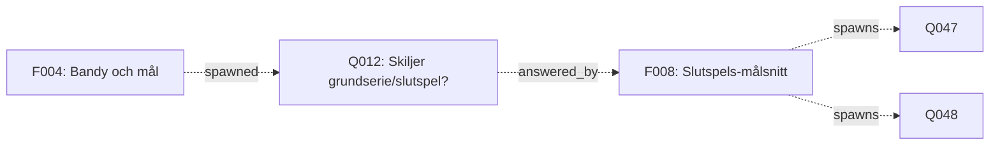

# PASS_8_INSTRUCTION — Templating, backfill av H-facts, Erik-kö, fördjupad UI

**Skapad:** 2026-04-26
**Förutsätter:** Pass 7 klart (Q-trädet, backfill, verifiering, länkrensning)
**Levereras till:** Code (största delen), Opus (granskning av H-backfill)
**Beräknad tid:** ~5-6 timmar totalt

---

## SYFTE

Pass 7 byggde trädet uppåt-nedåt mellan findings och frågor. Kvar
finns sju saker som listades under "VAD SOM INTE INGÅR" i tidigare
spec, plus två problem som blivit tydliga under pass 6-7.

Två som är kritiska:

1. **Sifferdata är hårdkodad i finding-prosa.** Finding 004 skriver
   "9,12 mål i snitt" inline — om S001 ändras vid ny Bandygrytan-
   import säger finding 004 fortsatt 9,12. Tyst drift mellan facts
   och findings.

2. **Backfill av H-facts har inte gjorts.** Pass 5 specade H002-H003
   för 005:s konkurrerande tolkningar. 46 övriga findings har inte
   granskats för konkurrerande hypoteser i prosan.

Resten är förbättringar som blir relevanta när trädet är i drift och
basbruket etablerat.

---

## DEL 1 — SIFFERDATA-TEMPLATING (PRIORITET A)

### 1.1 — Problem

I finding 004:

```
<strong>Mål per match</strong> —
<a href={factHref("S001")} class="fact-ref">S001</a>
9,12 mål i snitt.
```

`9,12` är hårdkodat. När S001 uppdateras (ny Bandygrytan-säsong, eller
korrigering av kalibreringstarget) säger finding fortsatt 9,12.
Två sanningar, garanterad drift.

Detta finns på minst hundra ställen tvärs över 46 findings. Ingen
manuell fix-kampanj är realistisk.

### 1.2 — Lösning

Code introducerar en Astro-helper:

```js
// bandy-brain/src/lib/facts.ts
export function factValue(id: string, formatter?: (v: any) => string): string {
  const fact = loadFacts().find(f => f.fact_id === id);
  if (!fact) throw new Error(`Unknown fact ${id}`);
  if (formatter) return formatter(fact.value);
  return String(fact.value);
}

export function factPct(id: string): string {
  return `${factValue(id)} %`;
}

export function factGoals(id: string): string {
  return factValue(id).replace('.', ',');  // 9.12 → 9,12 svensk konvention
}
```

Findings använder helpern istället för hårdkodade siffror:

```astro
---
import { factValue, factGoals, factHref } from '../../../lib/facts';
---

<strong>Mål per match</strong> —
<a href={factHref("S001")} class="fact-ref">S001</a>
{factGoals("S001")} mål i snitt.
```

Vid build-time renderas siffran från fact-filen. Ändras S001 →
findings reflekterar automatiskt.

### 1.3 — Backfill för 46 befintliga findings

Code skapar `scripts/pipeline/template_backfill.py`:

För varje finding 001-046:

1. Parsa Astro-filen
2. Identifiera `<a href={factHref("Sxxx")}>` följt av tal (regex på
   svenska siffror med komma, t.ex. `9,12`, `78,1 %`, `4,88`)
3. Verifiera att talet motsvarar fact-värdet (om inte: logga som
   *inkonsistens* — de finns sannolikt)
4. Ersätt hårdkodad siffra med `{factGoals("Sxxx")}` (eller motsvarande
   helper baserat på unit)
5. Skriv tillbaka filen

Varianter att hantera:

- **Procent**: "78,1 %" → `{factPct("S013")}`
- **Mål per match**: "9,12" → `{factGoals("S001")}`
- **Heltal**: "1124 matcher" → `{factValue("S001", v => v.match_count)}` (om match_count blir templatebart)
- **Sammansatt**: "4,93 (beräknat)" → behåll som är. Härledd siffra
  som inte direkt finns i fact.

Sista typen är problematisk. Lösning: introducera `derived:`-fact-typ.
Eller acceptera att vissa siffror förblir hårdkodade men markeras med
en HTML-kommentar `<!-- derived from S012 + S014 -->` så framtida
granskning vet vad det är.

Code-bedömning per fall.

### 1.4 — Inkonsistens-rapport

Backfill-scriptet producerar `docs/findings/TEMPLATE_BACKFILL_2026-04-26.md`:

- Antal findings processade
- Antal templatings utförda
- Antal hittade inkonsistenser (siffran i prosan stämmer inte med
  fact-värdet) — kräver Opus-granskning
- Antal siffror lämnade hårdkodade (derived/sammansatta)

Inkonsistens är troligen sällsynt men kritiskt — varje förekomst är
ett tecken på att något redan har drivit isär. Opus läser rapporten
och bestämmer fall för fall: är finding fel, eller är fact-värdet fel?

### 1.5 — Krav på framtida findings

Pipelinen uppdateras: alla nya findings ska använda templating.
Inga hårdkodade siffror som motsvarar fact-värden. Code uppdaterar
prompt i `scripts/pipeline/generate.py` med exempel.

Linter (om CI har det) varnar om en siffra som matchar ett fact-värde
står hårdkodad i en finding-prosa.

---

## DEL 2 — H-FACT-BACKFILL (PRIORITET A)

### 2.1 — Problem

Pass 5 specade att findings ska generera H-facts från konkurrerande
tolkningar — men bara 005 fick det gjort. De 46 pipeline-genererade
findings kan ha konkurrerande tolkningar i prosan som inte
materialiserats.

Värt att notera: pipelinen är troligen inte särskilt tendentiös att
producera explicit konkurrerande tolkningar (LLMs gillar att ge ett
svar). Men det förekommer — finding 004 säger t.ex. att hög målsnitt
påverkar hur man läser ledningar, utan att hypotetisera *varför*
halvtidsledning är 78% och inte 90%.

### 2.2 — Backfill-script

Code skapar `scripts/pipeline/h_backfill.py`:

För varje finding 001-046:

1. Skicka findingens "Tolkning"-sektion till LLM med prompten:
   "Identifiera konkurrerande hypoteser i denna text. Ge upp till 3
   distinkta hypoteser per identifierat fenomen. Om bara en tolkning
   presenteras, returnera tom lista."
2. För varje identifierad hypotes: skapa H-fact-utkast med
   `predicted_value`, `test_method`, `competing_hypotheses`
3. Producera `docs/findings/H_BACKFILL_2026-04-26.md` med utkasten
   för Opus-granskning **innan** de skrivs till `hypotheses/`

Detta är inte en automation som ska köras tyst. Hypoteser som skapas
fel är värre än inga — de förorenar trädet med påståenden ingen
faktiskt resonerade fram.

### 2.3 — Opus-granskning

Opus läser `H_BACKFILL_2026-04-26.md`. För varje förslag:

- **Behåll** om det är en genuin hypotes som finding presenterar
- **Förkasta** om det är en överöversättning (LLM:n gjorde "tolkning"
  till "hypotes" när det egentligen är en observation)
- **Kombinera** om två förslag är samma hypotes formulerad olika

Resultat: en kuraterad lista som Code skriver till `hypotheses/`.

Förväntat antal: 5-15 verkliga H-facts från 46 findings.

### 2.4 — Finding-uppdateringar

För varje finding som får nya H-facts: uppdatera "Tolkning"-sektionen
med Q-fact-style "Båda hypoteserna är formaliserade som Hxxx och Hxxx
— se data-extraktionsplan där." (samma princip som 005).

---

## DEL 3 — ERIK REVIEW QUEUE (PRIORITET B)

### 3.1 — Princip

Erik är domänexpert. Han har inte granskat något. Verifierings-fältet
från pass 7 fungerar — men utan en *kö* finns ingen mekanism för Erik
att veta vad han ska titta på.

Lösning: en sida som visar findings och facts som mest behöver hans
granskning, sorterade så han börjar med det viktigaste.

### 3.2 — /review/ sida

`bandy-brain/src/pages/review/index.astro`:

**Sektion 1 — Findings att verifiera:**

- Endast `domain: bandy` findings (Erik granskar bandy, inte spel-mekaniker)
- Inte redan verifierade
- Sorterade efter "viktighetsscore":
  - Antal fact-referenser (fler = viktigare)
  - Antal Q-facts som besvaras (besvarar centrala frågor = viktigare)
  - Antal andra findings som länkar hit (refererad mycket = viktigare)
- Topp 10 visas, "se alla" för fullständig lista

**Sektion 2 — Facts utan sista granskning:**

- R-facts som inte uppdaterats sedan pass 2 (2026-04-25 — vid pass 8
  fortfarande aktuellt eftersom säsongen inte är över)
- W-facts (fiktiv värld — Erik kan ha åsikter om klubbarnas kanon)
- Sorterade efter senaste verified_at desc, så åldsta granskning först

**Sektion 3 — Öppna Q-facts utan svar längre än 30 dagar:**

- Kandidater för status: closed eller manuell review
- Erik kan flagga frågor han tycker borde stängas eller prioriteras

### 3.3 — Verifiering via commit

Erik:s arbetsflöde:

1. Öppnar `/review/`
2. Klickar på en finding → läser
3. Om OK: gör commit med `verified_by: erik` + `verified_at: <datum>`
   i finding-frontmatter
4. Om problematisk: gör issue med label `review-flagged`
5. Pipeline behandlar `review-flagged`-issues som triggers för revision

Inga klick-knappar, ingen backend. Allt via git.

### 3.4 — Vad pipelinen gör med review-flagged

När en issue med label `review-flagged` öppnas:

1. Pipelinen genererar **inte** en ny finding
2. Pipelinen kommenterar issue: "Flaggning noterad. Mänsklig review
   krävs."
3. En notis läggs i `docs/findings/REVIEW_FLAGS.md`

Det är allt. Vidare hantering är manuell — Jacob eller Erik avgör om
finding ska revideras, dras tillbaka, eller förklaras.

---

## DEL 4 — TRÄDVISUALISERING (PRIORITET B)

### 4.1 — Princip

Pass 7 lämnade trädet textbaserat. När Q-fact-trädet växer blir
visualiseringen värdefull — men den ska inte byggas innan datan är
intressant att visualisera.

Tröskeln för pass 8: när det finns minst 30 Qn med minst 5 svarade.
Då finns det kanter att rita.

### 4.2 — Implementation

`bandy-brain/src/pages/tree/index.astro` med Mermaid:



Mermaid är statiskt-renderbart i Astro. Inga klientkrav.

För 30+ noder blir grafen okänsligt stor. Lösning: filtrera per
domain (bandy/game) och per "mest aktiva" (Qn med flest related_findings).

### 4.3 — Inte nu

Bygg om/när Jacob säger till. Pass 8-instruktionen specar formatet
men Code implementerar bara om explicit beställt. Annars är det
overengineering innan datan är användbar.

---

## DEL 5 — Q-DETALJVY (PRIORITET C)

### 5.1 — När det behövs

`/questions/`-listan från pass 7 räcker så länge Qn är många och
inte aktivt granskade. När en Q har:

- Flera findings som spawnar den
- En finding som besvarar den
- Flera relaterade Qn

— då blir listan otillräcklig och en detaljvy värdefull.

### 5.2 — Implementation

`bandy-brain/src/pages/questions/[id].astro`:

- Frågans claim
- "Väckt av" — finding(s) som spawnade
- "Hypoteser" — Hn som hypotetiserar svar (om några)
- "Besvarad av" — finding (om status answered)
- "Relaterade frågor" — Qn med samma related_questions
- "Diskussion" — placeholder, manuella notes-fältet renderas som prosa

### 5.3 — Tröskel

När minst en Q har 3+ kopplingar (spawning findings + hypotheses +
related). Tills dess: listvyn räcker.

---

## DEL 6 — EMBEDDINGS-DEDUP (PRIORITET C)

### 6.1 — När det behövs

Pass 7 specade enkel string-match för Q-dedup. Vid 100+ Qn börjar
sannolikt false negatives uppstå (samma fråga formulerad olika).

Symtom: `related_questions:`-listor som verkar samla samma fråga
men inte länkas, eller Qn som duplicerar varandra.

### 6.2 — Implementation

Lägg till embeddings-baserad dedup som fallback:

1. För varje ny Q: kör string-match först (snabb, mest fallen)
2. Om string-match returnerar 0 träffar: kör cosine similarity mot
   befintliga öppna Qn med embeddings (Anthropic eller OpenAI)
3. Om similarity > 0,85: föreslå länkning, kräv manuell bekräftelse
4. Om similarity > 0,95: länka automatiskt

Tröskel: 0,85 är konservativt nog att undvika false positives men
fångar omformuleringar.

### 6.3 — Tröskel för aktivering

När `BACKFILL_2026-04-26.md` (från pass 7) visar fler än 10% Qn
som verkar duplicera men inte länkas. Code mäter manuellt.

---

## DEL 7 — FRONTMATTER-MIGRATION (PRIORITET C)

### 7.1 — Problem

Pipelinen producerar findings som markdown med "Vidare frågor"-
sektion i prosa. Q-extraktion sker via parsning. Det är fragilt:

- En pipeline-uppdatering som ändrar sektionsformat → backfill bryts
- Findings som inte följer mallen exakt → frågor missas
- Manuella findings (om någonsin skrivna direkt utan pipeline) →
  oförutsägbart format

### 7.2 — Lösning

Migrera till strukturerad frontmatter:

```yaml
---
title: "Bandy och mål"
finding_id: 004
date: 2026-04-25
domain: bandy
verified_by: null
verified_at: null
sources: [S001, S012, S014, S015]
spawned_questions: [Q012, Q013, Q014, Q015]  # Q-IDn
answers: []  # frågor som besvaras
---
```

Pipelinen producerar dessa fält direkt. UI-rendering läser från
frontmatter istället för parsa prosa.

"Vidare frågor"-sektionen i prosan blir en automatiskt genererad
lista från `spawned_questions:`.

### 7.3 — Migration

Engångskörning som:

1. Parsar varje finding 001-046
2. Extraherar fact-refs och Q-refs från prosan
3. Skriver dem till frontmatter
4. Lämnar prosa-sektionerna kvar (de är fortfarande läsbara, bara
   inte källan till länk-rendrering)

---

## ARBETSORDNING

**Prioritet A — körs nu:**

1. **Code** implementerar templating-helpers (1.2). (~30 min)
2. **Code** kör template-backfill mot 46 findings (1.3). (~1 timme)
3. **Opus** granskar inkonsistens-rapporten. (~30 min)
4. **Code** skriver h_backfill-script och kör mot 46 findings (2.2).
   (~1 timme)
5. **Opus** granskar `H_BACKFILL_2026-04-26.md` (2.3). (~45 min)
6. **Code** skriver kuraterade H-facts till `hypotheses/`. (~30 min)
7. **Code** uppdaterar pipeline-prompt med templating-krav (1.5).
   (~15 min)

**Prioritet B — när basbruket är etablerat:**

8. **Code** bygger /review/-sidan (3.2). (~1 timme)
9. **Code** lägger till review-flagged-hantering i pipeline (3.4).
   (~30 min)

**Prioritet C — när trösklar passeras:**

10. Trädvisualisering (4.2) — vid 30+ Qn, 5+ besvarade
11. Q-detaljvy (5.2) — vid första Q med 3+ kopplingar
12. Embeddings-dedup (6.2) — vid >10% missade duplikat
13. Frontmatter-migration (7.2) — när pipeline-formatet ska
    omarbetas av annan anledning, eller när manuella findings börjar
    skrivas

---

## STOP-CRITERIA

**Prioritet A — pass 8 är klart när dessa är gjorda:**

- [ ] Templating-helpers implementerade
- [ ] Template-backfill kört, inkonsistens-rapport granskad
- [ ] H-fact-backfill kört, kuraterad lista skriven till hypotheses/
- [ ] Pipeline-prompt uppdaterad med templating-krav
- [ ] AUDIT_PASS_8 producerad

**Prioritet B och C kvarstår som backlog** och triggas av Jacob
eller av tröskelvillkor.

---

## VAD SOM INTE INGÅR

**Webbgränssnitt för verifiering.** Permanent uteslutet — verifiering
sker i git, inte via UI. Pass 7-principen står fast.

**Q-fact superseded-mekanism.** Det är `status: closed` med en
not. Ingen separat lifecycle behövs.

**Multi-author-funktionalitet.** Om Erik vill bidra med egna findings:
han skriver markdown och commit:ar. Ingen UI för det.

**Kommentarsfunktion på findings.** Sajten är statisk. Diskussion
sker i issues eller utanför sajten.

**Sökfunktion.** 46 findings är listbart. När antalet överstiger ~200
blir sökning meningsfullt — då, inte nu.

---

## ANMÄRKNING OM PRIORITET

Pass 8 har kritisk del (A), läget-tillåter-del (B) och vänta-tills-
behov-del (C). Det är medvetet.

Fel jag gjort i tidigare pass-instruktioner är att specifiera allt
som måste göras nu. Det leder till overengineering — vi bygger
strukturer mot problem som ännu inte finns.

Prioritet C är där om/när tröskeln passeras. Ingen anledning att
bygga embeddings-dedup om string-match räcker. Ingen anledning att
bygga grafvy om datan är trivial.

Det är pass 8:s egentliga lärdom: bygga för det vi ser, inte för det
vi kan tänka oss.
